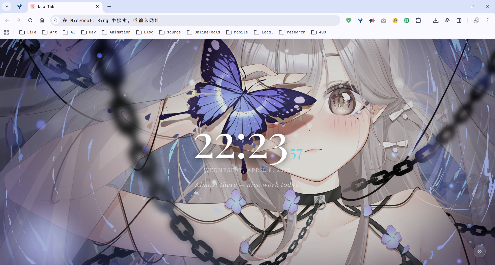

# PTab

> 以本地视频为背景的沉浸式 Chrome 新标签页扩展

**AI 开发文档**: [docs/.ai/index.md](docs/.ai/index.md)

>[!NOTE]
> 本项目90%以上代码由AI生成

<!--  -->


每次打开新标签页，都是一段属于自己的安静时刻。

---

## 功能

- **全屏视频背景** — 播放本地 MP4 视频，完全离线，无需联网
- **实时时钟** — 大字 HH:MM + 秒数高亮，每秒更新
- **智能问候语** — 根据时段（清晨 / 上午 / 下午 / 傍晚 / 深夜）随机显示
- **个性化设置** — 切换视频、调整遮罩深度、自定义主题色
- **轻量无依赖** — 数据存 localStorage，不联网，无追踪

---

## 预览



---

## 项目结构

```
PTab/
├── assets/                    # 仓库静态资源
├── public/
│   ├── manifest.json          # Chrome 扩展配置（MV3）
│   ├── icon.png               # 扩展图标 48x48 64x64 128x128
│   └── videos/
│       └── background.mp4     # 把你的视频放这里
├── src/
│   ├── components/
│   │   ├── VideoBackground.jsx  # 全屏视频 + 遮罩
│   │   ├── Clock.jsx            # 实时时钟
│   │   ├── Greeting.jsx         # 按时段问候语
│   │   └── SettingsPanel.jsx    # 设置面板
│   ├── App.jsx                  # 根组件 / 状态管理
│   ├── App.css                  # 全局样式
│   └── main.jsx                 # 入口文件
└── index.html
```

---

## 快速开始

### 环境要求

- Node.js 18+
- Google Chrome 88+ 或 Microsoft Edge 88+

### 1. 克隆仓库

```bash
git clone https://github.com/csy214-beep/PTab.git
cd PTab
```

### 2. 安装依赖

```bash
npm install
```

### 3. 放入视频

将你的背景视频复制到 `public/videos/`，命名为 `background.mp4`。

> 推荐：MP4 格式，1920×1080，50MB 以内，15 秒以上（循环播放）
> 免费素材可以去 [Pexels](https://www.pexels.com/videos/) 或 [Pixabay](https://pixabay.com/videos/) 下载

### 4. 本地预览

```bash
npm run dev
# 访问 http://localhost:5173
```

### 5. 构建扩展

```bash
npm run build
# 产物输出到 dist/ 文件夹
```

### 6. 加载到 Chrome

1. 打开 `chrome://extensions/`
2. 右上角开启 **开发者模式**
3. 点击 **加载已解压的扩展程序**
4. 选择项目的 `dist/` 文件夹
5. 打开一个新标签页，完成！

---

## 自定义

### 添加更多视频

把视频文件放入 `public/videos/`，然后在 `src/components/SettingsPanel.jsx` 里的 `PRESET_VIDEOS` 数组中追加一行：

```js
const PRESET_VIDEOS = [
  { label: "Default  (background.mp4)", value: "videos/background.mp4" },
  { label: "Ocean    (ocean.mp4)", value: "videos/ocean.mp4" }, // 新增
];
```

重新 `npm run build`，刷新扩展即可。

### 修改问候语

编辑 `src/components/Greeting.jsx` 里的 `GREETINGS` 对象，按时段替换成你想要的文案。

### 修改字体

`App.css` 顶部换掉 Google Fonts 链接，然后全局替换 `Playfair Display` 和 `Noto Serif SC` 即可。

---

## 技术栈

| 技术         | 用途                             |
| ------------ | -------------------------------- |
| React 18     | UI 组件与状态管理                |
| Vite 5       | 构建工具                         |
| CSS3         | 样式（毛玻璃 / 动画 / CSS 变量） |
| localStorage | 设置与数据持久化                 |
| Chrome MV3   | 扩展规范                         |

---

## 常见问题

**视频不播放，显示深色背景？**
检查 `dist/videos/` 目录下是否有对应文件，文件名是否与设置中一致（区分大小写）。

**修改代码后扩展没更新？**
重新 `npm run build`，然后在 `chrome://extensions/` 页面点击扩展的刷新图标，再打开新标签页。

**能在 Edge 上用吗？**
可以，步骤完全相同，地址栏换成 `edge://extensions/`。

---

## License

[MIT](LICENSE)
